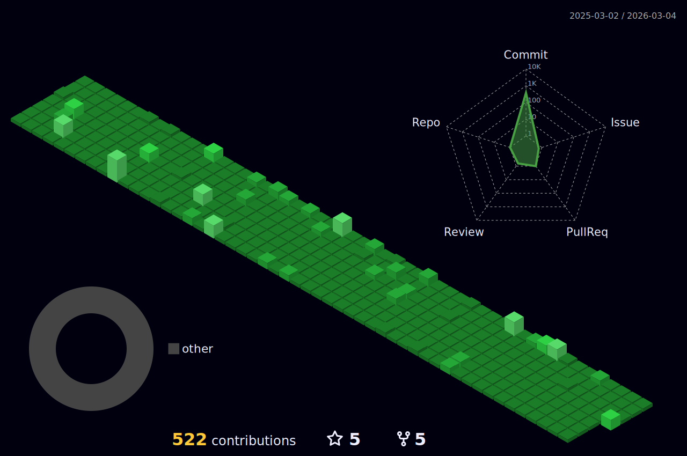

	
   

	

	
  

  

	<h2>I'm a Junior Backend Developer</h2>
	<ul>
		<li>😄 I love Spring, Spring Boot also JPA!!!</li>
		<li>🌱 I’m currently learning JPA, Querydsl</li>
		<li>💬 Ask me whatever you're curious about!!!</li>
	</ul>

	<h3>My certificate</h3>
	<ul>
		<li>Engineer Information Processing</li>
		<li>Computer Specialist in Spreadsheet & Database Level-2</li>
		<li>SQLD(Structured Query Language Developer)</li>
	</ul>

<h3 align="center">🛠 Tech Stack 🛠</h3>

  </a>&nbsp 
  </a>&nbsp 
  </a>&nbsp 
  </a>&nbsp
  </a>&nbsp
  </a>&nbsp 
    
  </a>&nbsp
  </a>&nbsp
  </a>&nbsp
  </a>&nbsp
    

  
  
   
<!--
**MinChul-Son/MinChul-Son** is a ✨ _special_ ✨ repository because its `README.md` (this file) appears on your GitHub profile.
  </a>&nbsp 
  </a>&nbsp 
  </a>&nbsp
  </a>&nbsp
  </a>&nbsp
  </a>&nbsp 
  </a>&nbsp 
Here are some ideas to get you started:

- 🔭 I’m currently working on ...
- 🌱 I’m currently learning ...
- 👯 I’m looking to collaborate on ..
- 🤔 I’m looking for help with ...
- 💬 Ask me about ...
- 📫 How to reach me: ...
- 😄 Pronouns: ...
- ⚡ Fun fact: ...
-->
